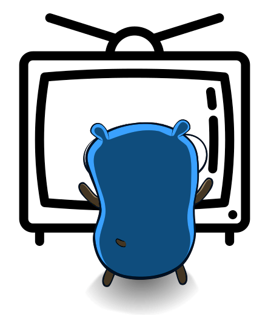

# go-subtitles
Go library and command-line utility to work with subtitle files.

<p align="center">
  
</p>

go-subtitles aims to be a powerful library, that makes working with subtitle files a breeze!!

## Features
* Works with SubRip `.srt` and WebVTT `.vtt` files
* Designed with modularity and extensibility in mind
* Extensively tested using Table-Driven Tests. Always at >95% coverage
* Easy to work with, either as an imported package or a command-line application (soon!)

Most of the actions you might expect from such a tool are already implemented! 

Timeshifting, pacing, searching, adding and deleting new subs, getting practical information (such as running time, or average characters-per-minute)

One of the most nifty features, is that it allows to parse a collection of subtitle files at once, and then query them using SQL syntax, from an SQLite database.


## Roadmap 
Since starting the 'project' I've been jotting down my brainstorming, and created a notepad of ideas that I'd like to implement in the future. All these ideas are available [roadmap.md](/roadmap.md). You're more than welcome to take a look, and propose new ones!


## Examples

```go
got := ParseSRTFile("game-of-thorns-s01e01.srt")

ts := time.Duration(2 * time.Second)

// Subtitle files can be timeshifted
got = TimeshiftSubtitle(got, ts)

// And also their 'pace can be adjusted, eg. to match video playing at 1.5x speed
got, err = PaceSubtitleFile(got, 1.5)

// Subtitles are available for searching, even using Regular Expressions
mentionsOfJon, err := SearchSubtitleFile(got, "Jon")
mentionsOfJD, err := SearchSubtitleFiles(got, "Jon|Dany")

// Along with other common actions, such as adding new subtitles, or deleting unwanted ones
got, err = RemoveSubtitle(got, 10)
got, err = AddSubtitle(got, "5m2.120s", "5m3.302s", "SPOILER ALERT!")


// Subtitle File information is available, such as
// detected overlaps, characters-per-minute, total running time etc
PrintSubfileInfo(got)

// The library can try some optimizations, such as serializing the subtitle indices, removing illegal HTML tags or ...

```

## Prerequisites
* Go >= 1.12
* [`go-cmp`](https://github.com/google/go-cmp/) to compare structs, in place of reflection


The dependencies can be installed by running
```
go get -u github.com/google/go-cmp/cmp
```
The library requires at least Go 1.12. Most of the functionality was developed using the standard library, and conscious steps to avoid complicated dependencies 
github.com/google/go-cmp/cmp

## Installation


btw flaticon for television in logo
